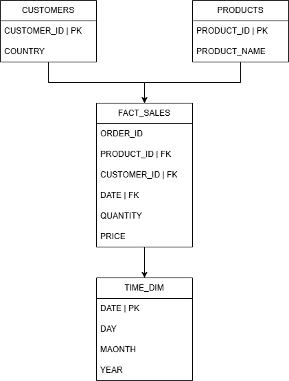

# Online Retail Data Engineering Pipeline

## Overview

This project implements an end-to-end data engineering pipeline for processing online retail transaction data.

The pipeline:
- Ingests raw batch files simulating real-time data
- Reads and validates data from HDFS using Apache Spark
- Performs distributed data cleaning and transformation
- Orchestrates workflow execution with Apache Airflow
- Loads curated analytical tables into Snowflake

The final warehouse follows a **Star Schema** design to support analytics and business intelligence workloads.

---

## Architecture Diagram


---

## DWH Schema



---

## Tech Stack

| Tool | Purpose |
|------|---------|
| Apache Airflow | Workflow orchestration |
| Apache Spark (PySpark) | Distributed data processing |
| HDFS | Distributed file storage |
| YARN | Cluster resource management |
| Snowflake | Cloud Data Warehouse |
| Docker Compose | Local containerized environment |
| Python | Pipeline scripting |
| Pandas | Batch simulation & lightweight preprocessing |

---

## Project Structure

```
etl-project/
│
├── dags/
│   └── etl_dag.py
│
├── data/
│   └── data.csv
|   └── batshes/
│
├── docs/
│   ├── architecture_diagram.png
│   └── dwh_schema.png
│
├── notebooks/
│   └── spark_hdfs.ipynb
│
├── scripts/
│   ├── simulate.py
│   └── load_to_snowflake.py
│
├── .gitignore
├── README.md
└── docker-compose.yaml
```

---

##  Pipeline Architecture

```
CSV Data → Simulation Script → HDFS → Spark → Airflow DAG → Snowflake
```

### Airflow DAG Tasks

```
spark_extract → extract → transform → load
```

| Task | Description |
|------|-------------|
| `spark_extract` | Reads batch files from HDFS using Apache Spark |
| `extract` | Merges all batch CSV files into one dataset |
| `transform` | Cleans and normalizes the data |
| `load` | Loads Star Schema tables into Snowflake |

---

## Data Warehouse Design

```
CUSTOMERS ──────►┐
                 │
PRODUCTS  ──────►├──► FACT_SALES
                 │
TIME_DIM  ──────►┘
```

### Fact Table
- `FACT_SALES` (ORDER_ID, CUSTOMER_ID FK, PRODUCT_ID FK, DATE FK, QUANTITY, PRICE)

### Dimension Tables
- `CUSTOMERS` (CUSTOMER_ID PK, COUNTRY)
- `PRODUCTS` (PRODUCT_ID PK, PRODUCT_NAME)
- `TIME_DIM` (DATE PK, DAY, MONTH, YEAR)

---

## Snowflake Configuration

| Setting | Value |
|---------|-------|
| Database | ETL_PROJECT |
| Schema | STAR_SCHEMA |
| Warehouse | COMPUTE_WH |

---

## How to Run

### 1. Start all services
```bash
docker compose up -d
```

### 2. Simulate real-time data
```bash
python scripts/simulate.py
```

### 3. Upload batches to HDFS
```bash
docker exec hadoop-namenode hdfs dfs -mkdir -p /user/airflow/data/batches
docker cp ./data/batches hadoop-namenode:/tmp/batches
docker exec hadoop-namenode hdfs dfs -put /tmp/batches /user/airflow/data/
```

### 4. Open Airflow and trigger the DAG
```
http://localhost:18080
DAG: etl_pipeline → Trigger
```

### 5. Open Jupyter (Spark)
```
http://localhost:8899
```

### 6. Open Hadoop UI
```
http://localhost:9870
```

---

## Output Validation

The pipeline was validated by:
- Successful Airflow DAG execution
- Spark logs showing rows read from HDFS
- Snowflake tables loaded correctly

### Example validation queries

```sql
-- Total rows loaded
SELECT COUNT(*) FROM ETL_PROJECT.STAR_SCHEMA.FACT_SALES;

-- Top 5 countries by revenue
SELECT C.COUNTRY, SUM(F.QUANTITY * F.PRICE) AS REVENUE
FROM FACT_SALES F
JOIN CUSTOMERS C ON F.CUSTOMER_ID = C.CUSTOMER_ID
GROUP BY C.COUNTRY
ORDER BY REVENUE DESC
LIMIT 5;

-- Monthly revenue
SELECT T.MONTH, T.YEAR, SUM(F.QUANTITY * F.PRICE) AS MONTHLY_REVENUE
FROM FACT_SALES F
JOIN TIME_DIM T ON F.DATE = T.DATE
GROUP BY T.YEAR, T.MONTH
ORDER BY T.YEAR, T.MONTH;
```

---

## Key Learning Outcomes

- ETL orchestration with Airflow
- Distributed storage with HDFS
- Distributed processing with Spark
- YARN-based resource management
- Dimensional modeling (Star Schema)
- Loading curated analytical data into Snowflake

---

## Author

**Ahmed Nail**
GitHub: [@Ahmed-nail](https://github.com/Ahmed-nail)
